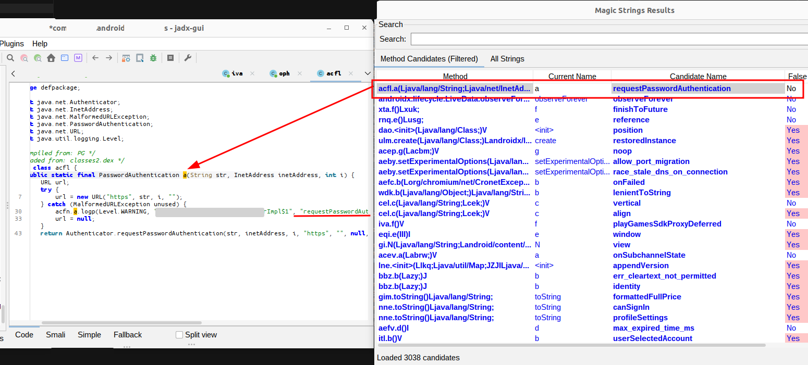

## JADX Magic Strings Plugin

A JADX plugin that extracts information from string constants.

### Features

The plugin extracts and analyzes string constants from decompiled code to find:

1. **Source File References**: Detects references to Java/Kotlin source files (`.java`, `.kt`, `.kts`, `.scala`, `.groovy`) in string constants
2. **Method Name Candidates**: Identifies potential method names from strings using regex patterns
3. **String Analysis**: Collects all string constants with their associated methods and classes

### Installation

#### Option 1: Install from GitHub (Recommended)

If this plugin is published to GitHub, you can install it directly:

```bash
jadx plugins --install "github:0rshemesh:jadx-magic-strings"
```

#### Option 2: Build and Install from Source

1. **Clone the repository**:
   ```bash
   git clone https://github.com/0rshemesh/jadx-magic-strings.git
   cd jadx-magic-strings
   ```

2. **Build the plugin**:
   ```bash
   ./gradlew build
   ```

3. **Install the plugin**:
   ```bash
   jadx plugins --install-jar build/libs/jadx-magic-strings-1.0.0.jar
   ```

   Or manually copy the JAR to JADX plugins directory:
   - **Linux/Mac**: `~/.local/share/jadx/plugins/dropins/`
   - **Windows**: `%APPDATA%\jadx\plugins\dropins\`

### Building the Plugin

The plugin can be built independently:

```bash
./gradlew build
```

The plugin JAR will be created at:
```
build/libs/jadx-magic-strings-1.0.0.jar
```

**Requirements:**
- Java 11 or higher
- Gradle (or use the included Gradle wrapper: `./gradlew`)

### Usage

#### In JADX GUI

1. **Install the plugin** (see Installation section above)

2. **Run JADX GUI**:
   ```bash
   jadx-gui
   ```

3. **Open your APK/DEX file** in JADX GUI

4. **Wait for decompilation** to complete (the plugin runs automatically after decompilation)

5. **Access the plugin**:
   - Go to the **Plugins** menu in the menu bar
   - Click on **"Magic Strings: Show Results"**
   - A dialog window will open with multiple tabs:
     - **Source Files**: Tree view showing detected source file paths and their references
     - **Top Candidates + Source Files**: Combined view of highest-scoring method candidates grouped by source file
     - **Method Candidates (Filtered)**: Table showing filtered method name candidates
     - **All Strings**: Table showing all extracted string constants



#### In JADX CLI

The plugin runs automatically during decompilation, but there's no CLI interface to view the results. Use the GUI to see the extracted information.

### How It Works

1. **After decompilation**, the plugin scans all methods in all classes
2. **Extracts string constants** from instruction nodes (CONST_STR instructions)
3. **Analyzes strings** using regex patterns:
   - Source files: Matches file paths ending in `.java`, `.kt`, etc.
   - Method names: Matches camelCase patterns that look like method names
4. **Stores results** in a data structure accessible via the GUI

### Example Use Cases

- **Reverse Engineering**: Find original source file names that might reveal project structure
- **Deobfuscation**: Identify method names from debug strings or error messages
- **Code Analysis**: Understand relationships between strings and methods
- **Malware Analysis**: Extract interesting strings that might indicate functionality

### Limitations

- The plugin only works after decompilation is complete
- String extraction depends on the code being decompiled (some obfuscated code may not have accessible strings)
- Method name detection uses heuristics and may produce false positives
- Source file detection relies on strings containing file paths (not always present)

### Technical Details

- **Plugin ID**: `magic-strings`
- **Pass Type**: `JadxAfterLoadPass` (runs after code is loaded)
- **Data Storage**: Uses `IJadxAttribute` to store data in `RootNode`
- **GUI Integration**: Adds menu action via `JadxGuiContext`
- **Required JADX Version**: 1.5.2 or higher

### Troubleshooting

**Plugin doesn't appear in menu:**
- Make sure the plugin is installed correctly
- Check that the plugin JAR is in the plugins directory
- Verify the service file exists: `META-INF/services/jadx.api.plugins.JadxPlugin`
- Ensure you're using a compatible JADX version (1.5.2+)

**No results shown:**
- The code might not contain relevant strings
- Try decompiling a different APK/DEX file
- Some obfuscated code may not have extractable strings

**Build errors:**
- Make sure you're using Java 11 or higher
- Run `./gradlew clean build` to rebuild everything
- Check that the JADX version in `build.gradle.kts` matches an available version on Maven Central

### Author

Created and maintained by **0rshemesh**.

- GitHub: [@0rshemesh](https://github.com/0rshemesh)
- Repository: [jadx-magic-strings](https://github.com/0rshemesh/jadx-magic-strings)
- Email: 0rshemesh@proton.me

### License

This plugin is licensed under the Apache License 2.0. See the [LICENSE](LICENSE) file for details.

